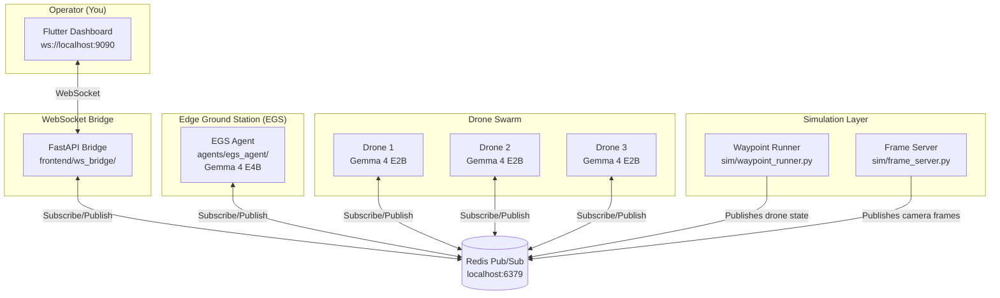
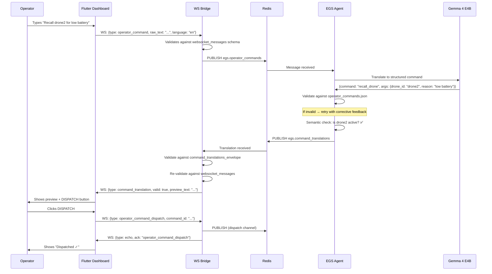
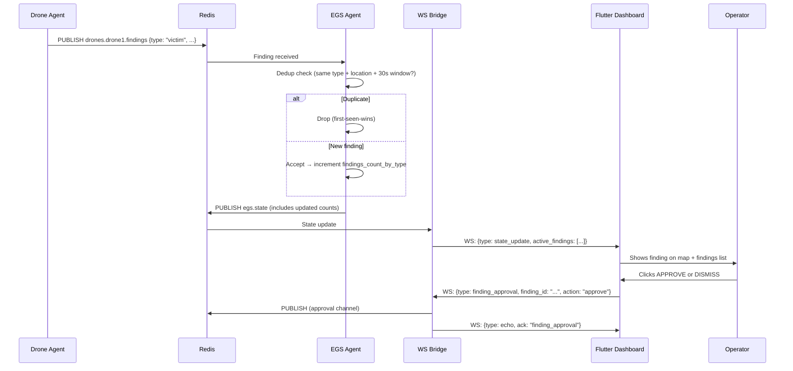

# Gemma-Guardian / FieldAgent

Multi-drone disaster-response coordinator powered entirely by on-device Gemma 4. Submission to the [Gemma 4 Good Hackathon](https://www.kaggle.com/competitions/gemma-4-good-hackathon) (Kaggle × Google DeepMind).

In post-disaster zones, cell towers fail in the first hour. Drones with cloud-AI dependencies become useless when they're needed most. We took the strongest published architecture for AI-driven disaster response ([Nguyen, Truong, Le 2026](https://arxiv.org/abs/2601.14437)) and removed its cloud GPT-4.1 dependency. Every drone has a brain. Every brain stays local. Every decision survives the disaster that broke the network.


*Live capture: drone1's onboard Gemma 4 E2B fires `report_finding` on a CC0 FEMA Hurricane Katrina aerial; the finding traverses Redis → FastAPI bridge → Flutter dashboard. Capture procedure: [`docs/runbooks/mcp-dom-verification.md`](docs/runbooks/mcp-dom-verification.md).*

## Where to start

- **What we're building and why:** [`docs/01-vision-and-pitch.md`](docs/01-vision-and-pitch.md)
- **Architecture overview:** [`docs/04-system-architecture.md`](docs/04-system-architecture.md) — three layers: per-drone Gemma 4 E2B agent, edge ground station with Gemma 4 E4B, Flutter operator dashboard.
- **The contracts that keep us in sync:** [`docs/20-integration-contracts.md`](docs/20-integration-contracts.md) (locked Day 1, do not change).
- **Scope and gates:** [`docs/17-feasibility-and-gates.md`](docs/17-feasibility-and-gates.md), [`docs/16-mocks-and-cuts.md`](docs/16-mocks-and-cuts.md).
- **AI assistant entry point:** [`CLAUDE.md`](CLAUDE.md) (read first if Claude Code or Cursor is editing this repo).

The full doc index — vision, hackathon context, fine-tuning plan, demo storyboard, submission checklist — lives under [`docs/`](docs/) and is mapped in [`CLAUDE.md`](CLAUDE.md).

## Install

```bash
# install uv (one-time): https://docs.astral.sh/uv/
curl -LsSf https://astral.sh/uv/install.sh | sh
# pick your role's slice (or --all-extras for everything)
uv sync --extra sim --extra mesh --extra dev   # Hazim
uv sync --extra drone --extra ml --extra dev   # Kaleel
uv sync --extra egs --extra dev                # Qasim
uv sync --extra ws_bridge --extra dev          # Ibrahim
```

Full setup (Redis, Ollama, per-platform notes, plain-pip fallback) lives in [`docs/13-runtime-setup.md`](docs/13-runtime-setup.md).

## Run the demo

```bash
# bring up Redis (system-managed) — see docs/13-runtime-setup.md for per-OS details
sudo service redis-server start    # Linux / WSL2
brew services start redis          # macOS

# one-command launch — full swarm in tmux, tails the waypoint log,
# stops cleanly on Ctrl-C.
scripts/run_full_demo.sh

# or launch with a fixed-duration self-terminate (handy for scripted demos)
scripts/launch_swarm.sh disaster_zone_v1 --duration=60
scripts/stop_demo.sh

# during the bridge cutover window: real sim drone state + fake egs/findings
# + uvicorn-launched bridge. Pass --no-fake-egs / --no-fake-findings to drop
# fakes once Qasim's EGS / Kaleel's drone agent ship.
scripts/run_hybrid_demo.sh disaster_zone_v1
scripts/stop_demo.sh hybrid_demo
```

The full-stack launcher is [`scripts/launch_swarm.sh`](scripts/launch_swarm.sh); the cutover orchestrator is [`scripts/run_hybrid_demo.sh`](scripts/run_hybrid_demo.sh). How the processes wire together is in [`docs/15-multi-drone-spawning.md`](docs/15-multi-drone-spawning.md), and what's transitionally faked is in [`docs/16-mocks-and-cuts.md`](docs/16-mocks-and-cuts.md).

## Team

Five-person team, vertical-slice ownership. Roles, interfaces, and decision-making authority: [`docs/18-team-roles.md`](docs/18-team-roles.md). 20-day timeline: [`docs/19-day-by-day-plan.md`](docs/19-day-by-day-plan.md).

| Person | Role | Primary scope |
|---|---|---|
| Hazim | Sim Lead | `sim/`, `agents/mesh_simulator/`, launch scripts, Redis infra |
| Kaleel | Drone Agent + ML | `agents/drone_agent/`, xBD fine-tuning |
| Qasim | EGS Coordinator | `agents/egs_agent/`, replanning, multilingual command path |
| Ibrahim | Frontend + Comms (lead) | `frontend/`, demo video, writeup, this README |
| Thayyil | Sim Co-Pilot | paired with Hazim — frame curation, scenario YAMLs |

## Status

In active development for the May 18, 2026 submission. Per-stream live status:

- [`sim/ROADMAP.md`](sim/ROADMAP.md) — Hazim / Thayyil surface (sim, mesh, scripts).
- [`TODOS.md`](TODOS.md) — cross-cutting follow-ups.

## License

Apache-2.0. See [`LICENSE`](LICENSE).


# Gemma-Guardian: Full System Flow

## The Big Picture

Gemma-Guardian is an **AI-powered disaster response drone swarm** operated from a command center dashboard. The entire system runs locally — no cloud — using **Gemma 4** models on Ollama for on-device AI.



---

## Layer by Layer

### 1. Simulation Layer — "The Physical World"

> **Who built it:** Hazim  
> **What it does:** Simulates drone flight — GPS positions, battery drain, heading, velocity

The sim reads a scenario YAML (e.g., `disaster_zone_v1.yaml`) that defines:
- A disaster zone polygon (lat/lon boundary)
- Pre-scripted waypoints for each drone
- Simulated camera frames (pre-recorded JPEGs from real disaster datasets)

**It publishes:**
- `drones.<id>.state` at 2 Hz — position, battery, heading, velocity
- `drones.<id>.camera` — JPEG frames per tick

> [!IMPORTANT]
> The sim drones follow scripted paths. They do NOT respond to commands — they're a physics simulator, not autonomous agents.

---

### 2. Drone Agents — "The Eyes in the Sky"

> **Who built it:** Kaleel  
> **What they do:** Each drone runs a local **Gemma 4 E2B** model that analyzes camera frames and reports findings

Each drone agent:
1. **Perceives** — analyzes the camera frame using the LLM
2. **Reasons** — decides if what it sees is a finding (victim, fire, smoke, damaged structure, blocked route)
3. **Reports** — publishes findings to `drones.<id>.findings`
4. **Validates** — the LLM output is validated against strict JSON schemas with a retry loop

**Findings are the core output:**
```json
{
  "finding_id": "f_drone1_047",
  "source_drone_id": "drone1",
  "type": "victim",
  "severity": 4,
  "gps_lat": 34.1234,
  "gps_lon": -118.5678,
  "confidence": 0.78,
  "visual_description": "Person prone, partially covered by debris..."
}
```

---

### 3. Edge Ground Station (EGS) — "The Brain"

> **Who built it:** Qasim  
> **What it does:** Aggregates everything, runs the local **Gemma 4 E4B** model for command translation and mission replanning

The EGS is the central coordinator. It:

#### A. Aggregates Drone State
- Subscribes to `drones.*.state` and `drones.*.findings`
- Builds a unified `egs_state` snapshot (all drones, all findings, survey progress)
- Publishes `egs.state` at 1 Hz for the dashboard

#### B. Deduplicates Findings
- When multiple drones report the same finding type at nearly the same GPS location within 30 seconds, the EGS keeps only the **first-seen** report
- This is the `EGS_DUPLICATE_FINDING` rule you see in the logs

#### C. Translates Operator Commands
The operator can type commands in **any language**. The EGS:

1. Receives the raw text from the dashboard (via Redis `egs.operator_commands`)
2. Sends it to **Gemma 4 E4B** on Ollama with a system prompt listing available commands
3. The LLM translates natural language → structured JSON command
4. The result is **validated** against the `operator_commands.json` schema
5. If validation fails, a **corrective retry loop** feeds the error back to the LLM
6. The validated translation is published back to the dashboard for preview

#### D. Replans Missions
- Uses the LLM to assign survey points to drones based on current state
- Publishes task assignments to `drones.<id>.tasks`

---

### 4. WebSocket Bridge — "The Translator"

> **Who built it:** Ibrahim  
> **What it does:** Bridges Redis pub/sub ↔ WebSocket for the Flutter dashboard

The bridge:
- Subscribes to Redis channels (`egs.state`, `drones.*.state`, `drones.*.findings`, `egs.command_translations`)
- Aggregates all state into a single `state_update` envelope
- Broadcasts to connected WebSocket clients at 1 Hz
- Validates ALL messages against JSON schemas before forwarding (defense in depth)
- Forwards operator commands FROM the dashboard TO Redis
- Forwards command translations FROM Redis TO the dashboard

---

### 5. Flutter Dashboard — "The Eyes of the Operator"

> **Who built it:** Ibrahim  
> **What it does:** Real-time command center UI

The dashboard shows:

| Panel | What it shows |
|---|---|
| **Map** | Drone positions (moving dots), findings (colored markers), zone polygon, aerial overlay |
| **Drone Status** | Per-drone: battery %, status (active/offline/returning), current task |
| **Findings** | List of reported findings with type, severity, source drone. **Approve/Dismiss** buttons |
| **Command Box** | Text input for operator commands → translate → preview → dispatch |
| **Validation** | Count of schema validation events (passes/failures) |

---

## The Command Flow (End to End)



---

## The Findings Flow



**What approve/dismiss does:**
- **Approve**: Confirms the finding is valid — the EGS treats it as verified intelligence for mission planning
- **Dismiss**: Marks it as a false positive — the EGS can deprioritize that area

---

## Where Gemma 4 Models Run

| Component | Model | Size | What it does |
|---|---|---|---|
| Each Drone Agent | `gemma4:e2b` | 2B params | Analyzes camera frames → reports findings |
| EGS Agent | `gemma4:e4b` | 4B params | Translates commands, replans missions |

Both run on **Ollama** locally. The EGS uses the larger model because command translation requires more reasoning capability than image description.

---

## Key Design Principles

1. **Schema-first**: Every message between components is validated against JSON schemas. Invalid messages are rejected with corrective feedback.

2. **Validate-and-retry**: When an LLM produces invalid output, the error is fed back as a corrective prompt. Up to 3 retries before falling back to a safe default.

3. **Edge-native**: Everything runs locally — no cloud dependency. Critical for disaster zones with no internet.

4. **Multilingual**: Operators can type commands in any language. Gemma 4 translates to structured English commands internally, then provides previews in the operator's language.

5. **Human-in-the-loop**: Commands require explicit DISPATCH confirmation. Findings require explicit APPROVE/DISMISS. The AI suggests, the human decides.

